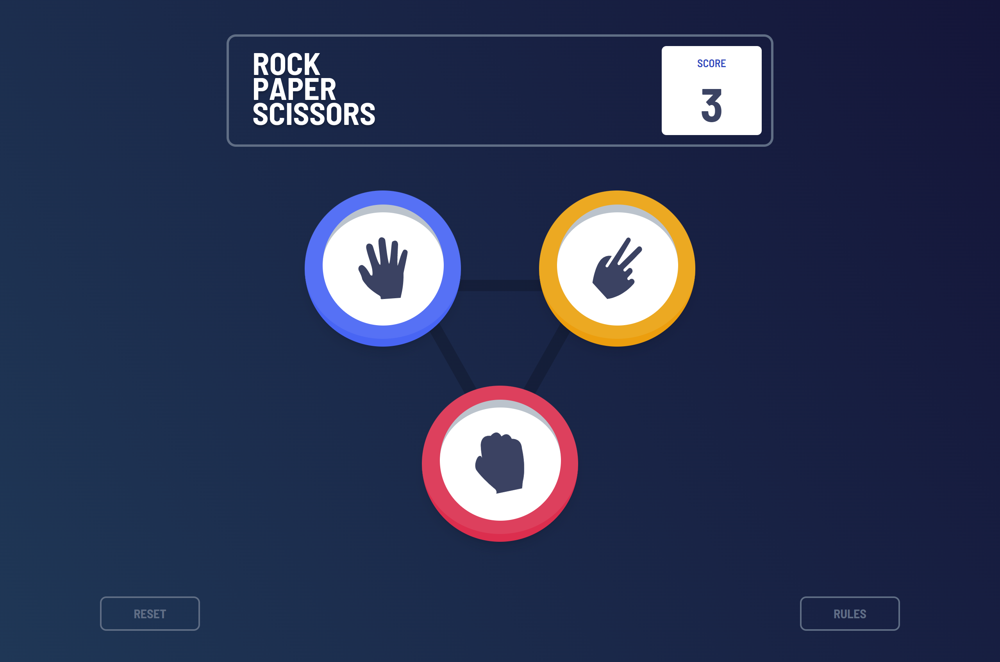

# Frontend Mentor - Rock, Paper, Scissors solution

This is a solution to the [Rock, Paper, Scissors challenge on Frontend Mentor](https://www.frontendmentor.io/challenges/rock-paper-scissors-game-pTgwgvgH). Frontend Mentor challenges help you improve your coding skills by building realistic projects.

## Table of contents

- [Overview](#overview)
  - [The challenge](#the-challenge)
  - [Screenshot](#screenshot)
  - [Links](#links)
- [My process](#my-process)
  - [Built with](#built-with)
  - [What I learned](#what-i-learned)
- [Author](#author)

## Overview

### The challenge

Users should be able to:

- View the optimal layout for the game depending on their device's screen size
- Play Rock, Paper, Scissors against the computer
- Maintain the state of the score after refreshing the browser _(optional)_
- **Bonus**: Play Rock, Paper, Scissors, Lizard, Spock against the computer _(optional)_

### Rules

If the player wins, they gain 1 point. If the computer wins, the player loses one point.

#### Original

- Paper beats Rock
- Rock beats Scissors
- Scissors beats Paper

### Screenshot



### Links

Live Site: [click here](https://rock-paper-scissors-game-et-moi.netlify.app/)

## My process

### Built with

- Semantic HTML5 markup
- Flexbox
- CSS Grid
- Mobile-first workflow
- [React](https://reactjs.org/) - JS library
- [TypeScript](https://www.typescriptlang.org/) - for Type Consistency
- [Vite Js](https://vitejs.dev/) - module bundler and build tool
- [tailwindCSS](https://tailwindcss.com/) - For styles
- [Framer Motion](https://www.framer.com/motion/) - For Animation

### What I learned

- One thing i'm proud of doing this project is: i was able to figure out how to use the React Context API with TypeScript

```js
export const GameContext = createContext<GameContextType>({} as GameContextType)
```

- Managing and modifying various states across the entire application

- Logic for the Game or AI found in the gameLogic File [GamePlayLogic](src/components/Game/GamePlayLogic.ts)

## Author

- Frontend Mentor - [@headbwoi](https://www.frontendmentor.io/profile/headbwoi)
- Twitter - [@headbwoi_1](https://www.twitter.com/headbwoi_1)
